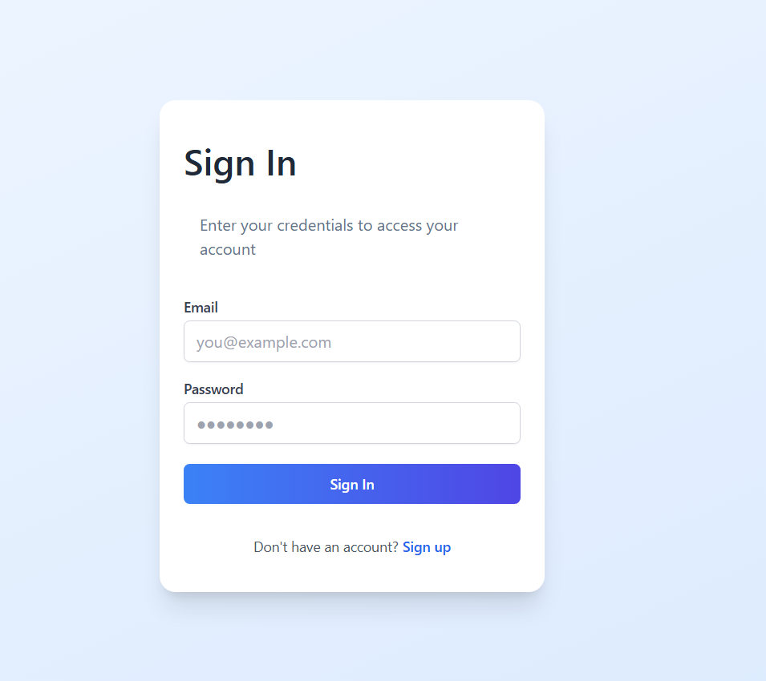
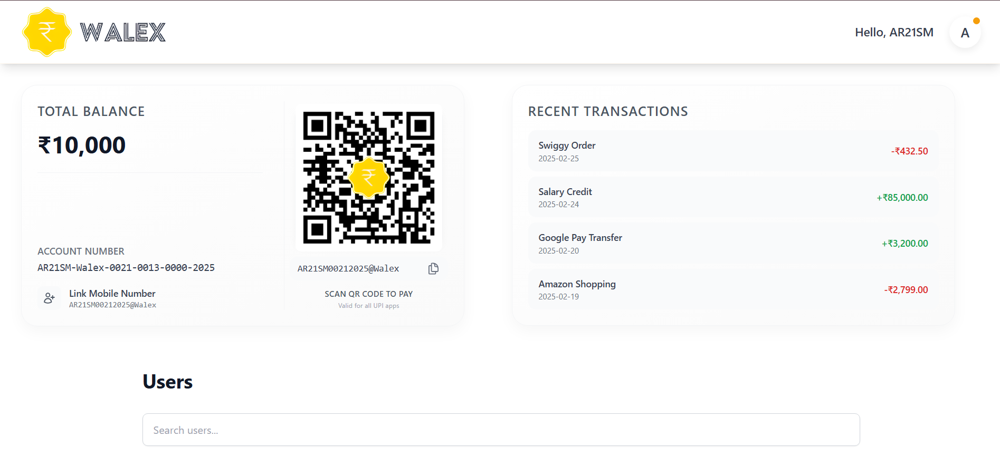
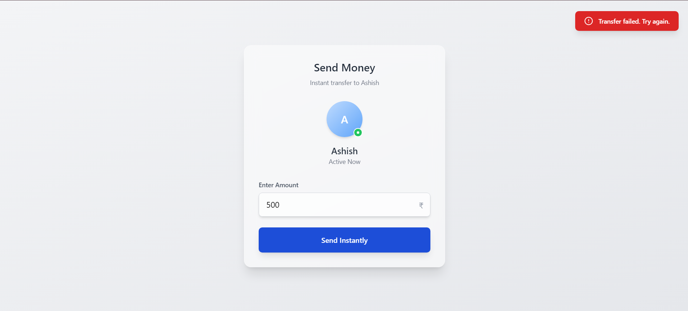
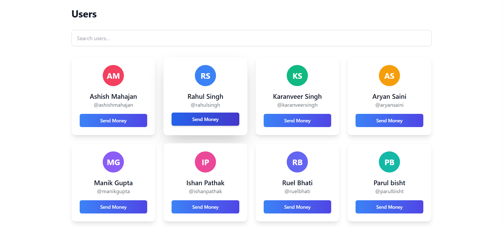
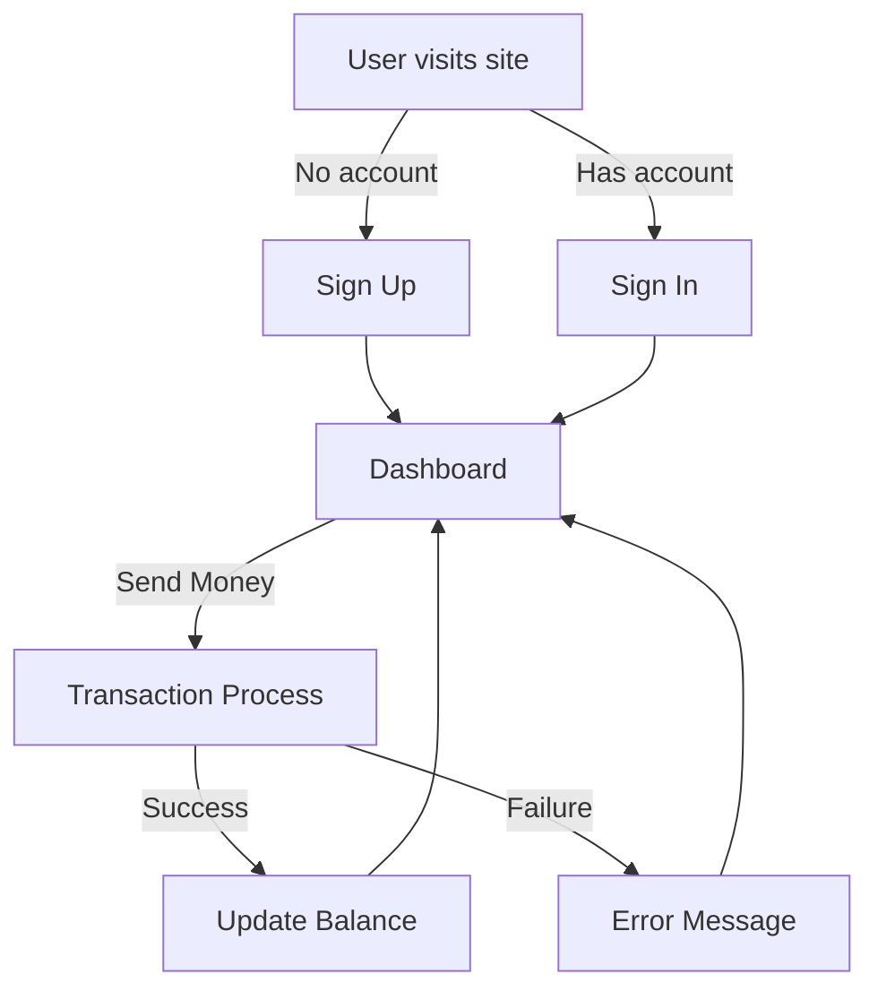

# Walex Web Application

## Table of Contents
1. [Introduction](#introduction)  
2. [Features](#features)  
3. [Technologies Used](#technologies-used)  
4. [Installation](#installation)  
5. [Usage](#usage)  
6. [API Endpoints](#api-endpoints)  
7. [Project Structure](#project-structure)  
8. [Security Measures](#security-measures)  
9. [Screenshots](#screenshots)  
10. [Flowchart](#flowchart)  

## Introduction
This project is **Walex**, a digital wallet web application developed using the **MERN stack** (MongoDB, Express.js, React.js, Node.js). It facilitates **secure digital transactions**, **real-time balance tracking**, and **seamless user authentication** with a modern and intuitive user interface. 

The application ensures **data integrity and security** using robust measures such as **JWT authentication, Mongoose Sessions, and Zod validation**.



## Features
- **User Authentication**: Secure Signup & Signin with JWT authentication.
- **Session-based Transactions**: Transactions are handled using Mongoose Sessions.
- **Real-time Updates**: UI updates dynamically for transactions and balances.
- **State Management**: React Context API/Redux.
- **Role-Based Access Control (RBAC)**: Admin & customer roles.
- **Secure Password Handling**: Password hashing with bcrypt.
- **Responsive UI**: Tailwind CSS for smooth adaptability across devices.
- **Error Handling & Logging**: Middleware for structured error responses.



## Technologies Used
### **Frontend**
- React.js (Vite for fast builds)
- Tailwind CSS for styling
- Axios for API requests
- React Router for navigation

### **Backend**
- Node.js
- Express.js
- MongoDB & Mongoose ORM
- Zod for request validation
- JWT for authentication

## Installation
### **Prerequisites**
- Install **Node.js** (v14 or higher)
- Install **MongoDB** and ensure it is running

### **Clone the Repository**
```sh
git clone https://github.com/AR21SM/Walex.git
```

### **Backend Setup**
```sh
cd backend
npm install
```
Create a `.env` file in the backend directory and add:
```env
MONGO_URI=your_mongodb_uri
JWT_SECRET=your_jwt_secret
```
Start the backend server:
```sh
npm start
```

### **Frontend Setup**
```sh
cd ../frontend
npm install
npm run dev
```

## Usage
1. Open `http://localhost:3000` for the frontend.
2. Use **Postman** or similar tools to test the backend API at `http://localhost:5000`.



## API Endpoints
### **User Authentication**
- **Register**
  - `POST /api/v1/signup`
  - Request Body:
  ```json
  {
    "firstName": "John",
    "lastName": "Doe",
    "email": "john@example.com",
    "password": "password123"
  }
  ```

- **Login**
  - `POST /api/v1/signin`
  - Request Body:
  ```json
  {
    "email": "john@example.com",
    "password": "password123"
  }
  ```

## Project Structure
```
walex-project/
│── backend/
│   │── routes/
│   │── controllers/
│   │── models/
│   │── middlewares/
│   │── config/
│   │── .env
│   │── index.js
│   │── package.json
│── frontend/
│   │── src/
│   │   │── assets/
│   │   │── components/
│   │   │── pages/
│   │   │── App.jsx
│   │── public/
│   │── index.html
│   │── package.json
│   │── tailwind.config.js
```

## Security Measures
- **JWT Authentication** with refresh tokens.
- **Encrypted Passwords** using bcrypt.
- **Role-Based Access Control (RBAC)** for admin and customer.
- **Input Validation** with Zod to prevent injection attacks.
- **CORS Handling** for secure cross-origin requests.



## Flowchart


---

                                            Made with ❤️ by AR21SM