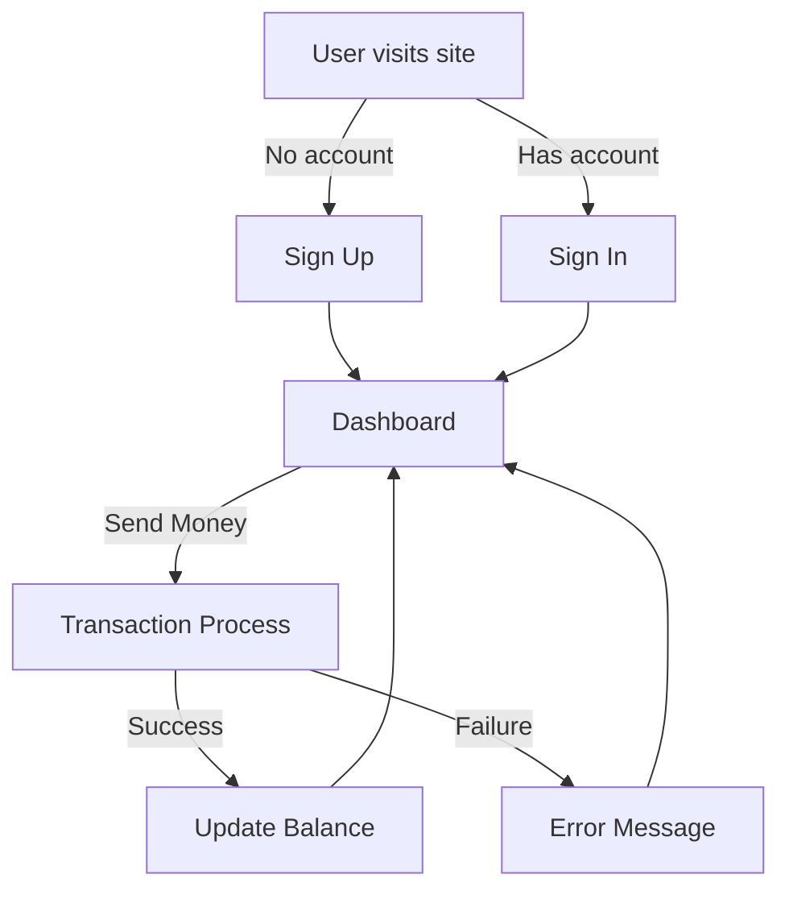

# PayTM-Like Web Application

## Table of Contents
1. [Introduction](#introduction)
2. [Features](#features)
3. [Technologies Used](#technologies-used)
4. [Installation](#installation)
5. [Usage](#usage)
6. [API Endpoints](#api-endpoints)
7. [Project Structure](#project-structure)
8. [Security Measures](#security-measures)
9. [Flowchart](#flowchart)
10. [Testing](#testing)
11. [Deployment](#deployment)


## Introduction
This project is a **PayTM-like web application** developed using the **MERN stack** (MongoDB, Express.js, React.js, Node.js). It facilitates **secure digital transactions**, **real-time balance tracking**, and **seamless user authentication** with a modern and intuitive user interface. The application ensures **data integrity and security** using robust measures such as **JWT authentication, Mongoose Sessions, and Zod validation**.

## Features
- **User Authentication**: Signup & Signin with secure JWT-based authentication.
- **Session-based Transactions**: Transactions are handled using Mongoose Sessions to maintain data integrity.
- **Real-time Updates**: Dynamic UI updates for transactions and balances.
- **State Management**: Efficient frontend state management using React Context API/Redux.
- **RESTful API**: Clean and well-structured backend API architecture.
- **Role-Based Access Control (RBAC)**: Different user roles such as admin and customer.
- **Transaction History**: Users can view their past transactions with filters.
- **Secure Password Handling**: Password hashing with bcrypt.
- **Responsive UI**: Built with Tailwind CSS for a seamless experience across devices.
- **Error Handling & Logging**: Integrated middleware for structured error responses and logging.
- **Multi-Factor Authentication (MFA) (Optional)**: For additional security.

## Technologies Used
### **Frontend**
- **React.js (Vite for fast builds)**
- **Tailwind CSS** for styling
- **Axios** for API requests
- **React Router** for navigation
- **Redux Toolkit (optional)** for state management

### **Backend**
- **Node.js**
- **Express.js**
- **MongoDB & Mongoose ORM**
- **Zod** for request validation
- **JWT** for authentication
- **Mongoose Transactions** for atomic transactions
- **Morgan** for logging
- **Dotenv** for environment variables

## Installation
### **Prerequisites**
- Install **Node.js** (v14 or higher)
- Install **MongoDB** and ensure it is running

### **Clone the Repository**
```sh
git clone https://github.com/AR21SM/PayTM.git
cd PayTM-Project
```

### **Backend Setup**
```sh
cd backend
npm install
```
Create a `.env` file in the backend directory and add:
```env
MONGO_URI=your_mongodb_uri
JWT_SECRET=your_jwt_secret
```
Start the backend server:
```sh
npm start
```

### **Frontend Setup**
```sh
cd ../frontend
npm install
npm run dev
```

## Usage
1. Open `http://localhost:3000` for the frontend.
2. Use **Postman** or similar tools to test the backend API at `http://localhost:5000`.

## API Endpoints
### **User Authentication**
- **Register**
  - `POST /api/v1/signup`
  - Request Body:
  ```json
  {
    "firstName": "John",
    "lastName": "Doe",
    "email": "john@example.com",
    "password": "password123"
  }
  ```
- **Login**
  - `POST /api/v1/signin`
  - Request Body:
  ```json
  {
    "email": "john@example.com",
    "password": "password123"
  }
  ```

### **Transactions**
- **Create Transaction**
  - `POST /api/v1/transactions`
  - Headers: `Authorization: Bearer <token>`
  - Request Body:
  ```json
  {
    "amount": 100,
    "type": "credit"
  }
  ```
- **Get Balance**
  - `GET /api/v1/user/balance`
  - Headers: `Authorization: Bearer <token>`

## Project Structure
```
paytm-project/
│── backend/
│   │── routes/
│   │── controllers/
│   │── models/
│   │── middlewares/
│   │── config/
│   │── .env
│   │── index.js
│   │── package.json
│── frontend/
│   │── src/
│   │   │── assets/
│   │   │── components/
│   │   │── pages/
│   │   │── App.jsx
│   │── public/
│   │── index.html
│   │── package.json
│   │── tailwind.config.js
```

## Security Measures
- **JWT Authentication** with refresh tokens.
- **Encrypted Passwords** using bcrypt.
- **Role-Based Access Control (RBAC)** for admin and customer.
- **Input Validation** with Zod to prevent injection attacks.
- **CORS Handling** for secure cross-origin requests.

## Flowchart


## Testing
- **Unit Tests** with Jest
- **Integration Tests** using Supertest
- **E2E Testing** with Cypress

## Deployment
### **Backend**
- Deploy using **Render**, **Heroku**, or **AWS EC2**.
- Use **MongoDB Atlas** for a cloud database.

### **Frontend**
- Deploy on **Vercel** or **Netlify**.

